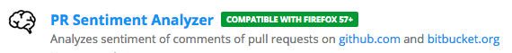
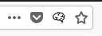
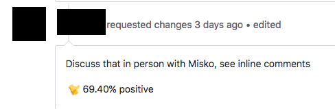

PRS-A - Pull Request Sentiment Analyzer
=======================================
*(pronounced "PRESS A")*

<a href="https://addons.mozilla.org/en-US/firefox/addon/pr-sentiment-analyzer">Add to Firefox</a>
|
<a href="https://chrome.google.com/webstore/detail/prs-a-pull-request-sentim/moboalaekngfbemhedeingankampfekm?hl=en-US">Add to Chrome</a>
         

When viewing a pull request, simply click the brain icon in the URL bar
------------------------------------------------------------------------

Comments will be annotated with their positivity score.
-------------------------------------------------------

Setup
-----
This plugin requires a <a href="https://azure.microsoft.com/en-us/try/cognitive-services/?api=text-analytics">Microsoft Azure Cognitive Services API key.</a>

Click the link, choose <b>Get API Key</b> and follow the steps.

Once you finish, you will end up with something that looks like the following:

You will need to enter the information the first time you click the icon.

Notices
-------
Brain icon from "Brain by Arjun Adamson from the Noun Project"
